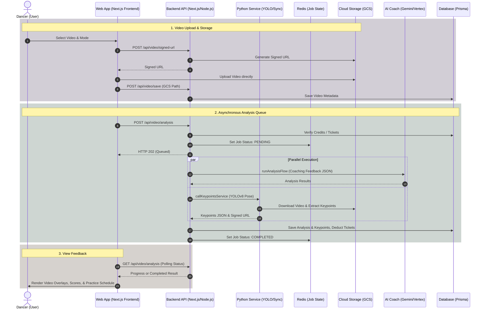

# 🕺 DanceBetter — AI Dance Coach & Video Analysis

> **Category:** AI & Computer Vision  
> **GitHub Link:** [Explore on GitHub](https://github.com/Pasindu-Vihangana)  
> **Tags:** `PyTorch` `OpenCV` `Pose Estimation` `React SaaS` `MediaPipe`


DanceBetter is an experimental, premium AI-powered dance coaching platform designed to help dancers of all levels analyze, understand, and refine their techniques. Whether you are preping for a social media challenge, preparing for a competition, or practicing a wedding routine, DanceBetter guides you toward your performance goals.

We've already crossed **1,000+ active users** and processed over **12,000+ video uploads** across **45+ dance styles**.

---

## 🚀 Key Features

### 1. Seamless Video Ingestion & Smart Uploads
Users can upload dance videos up to 300MB in size. 
- **Flexible Modes**: Dancers can select between **Individual Analysis** (for solo techniques) and **Side-by-side Comparison** (to match routines against reference/coach footage).
- **Client-Side Video Cropper**: A lightweight tool located at `/crop` that utilizes client-side FFmpeg processing to extract a precise 15-second loop of the routine without wasting server bandwidth or requiring user authentication.
- **Direct-to-Cloud Uploads**: The frontend uploads video binaries directly to Google Cloud Storage (GCS) via secure signed URLs. Raw video bytes never transit through the Node.js backend.


---

### 2. YOLOv8 Pose Estimation & Keypoint Tracking
Our specialized AI processing microservice handles high-performance pose estimation.
- **Keypoint Extraction**: Runs a `YOLOv8n-pose` model at 10fps, tracking 17 anatomical keypoints (nose, shoulders, elbows, wrists, hips, knees, ankles, ears, etc.) with a confidence threshold (>0.5).
- **Stable Dancer Identification**: To support couples and group routines, the service sorts detected persons left-to-right based on average shoulder and hip x-coordinates in every frame. This provides consistent tracking IDs (`person_id: 1` is always the leftmost dancer, etc.) even when dancers temporarily leave and re-enter the camera view, bypassing limitations of default tracker ID resets.


---

### 3. AI-Coach Video Analysis & Feedback
Our generative AI analysis translates physical movement into qualitative and quantitative scores.
- **Multi-Modal Gemini Analysis**: Integrates Vertex AI Gemini models to analyze the video and look for rhythm, posture, dynamics, posture correctness, and styling.
- **Group Routine Feedback**: Handles group routines by generating individual feedback scores and annotations for each dancer in the routine.
- **Real-time Analytics Dashboard**: Visually displays overall performance scores, rhythm/posture breakdowns, key highlights, and specific timestamps that need correction.


---

### 4. Side-by-Side Technique Comparison
Compare your dance covers, routines, and challenges side-by-side with an instructor or target video.
- **Temporal Alignment**: The Python Sync service attempts to temporally align the source and reference videos by matching keypoint velocities and pose timelines.
- **Dual Playback Fallback**: If synchronization fails, the system provides a split dual-player fallback so dancers can still visually audit their postures side-by-side.


---

### 5. Personalized AI-Generated Practice Schedule
Receive an actionable, personalized training regimen built dynamically based on your analysis results.
- **Targeted Corrections**: Generates customized exercises with detailed setup instructions and training goals (e.g., stabilizing the pelvis during arm sweeps, head-spotting speed).
- **Duration & Looping**: Specifies training frequency (e.g., "1 week - 10min daily") and anchors the instruction to the exact video loop timestamps (e.g., 0:00 - 0:04) showing where the mistake occurred.


---

## 📐 System Architecture & Data Flow

DanceBetter is built using a modern, decoupled microservices architecture designed to run on Google Cloud Platform (GCP) Cloud Run:



---

## 💳 Billing & Retention Strategy

Subscriptions and retention flows are managed dynamically using Stripe billing portal integrations:

- **Subscription Tiers**: Includes Free, Starter, Performer, Mastery, and Elite (Pro) memberships.
- **Downgrade/Cancellation Deflection**: When users click "Manage Subscription", the platform performs dynamic intent audits:
  - If a user cancels or downgrades due to budget, project breaks, or time, the system presents an automated **50% off discount coupon** (`MONTH50`) to improve retention before redirecting to the Stripe Portal.
  - If they report a technical issue, they are automatically routed to direct support.

---

## 🛠️ Codebase Structure

The project code is divided into three main repositories:

1. **Frontend Application**: [`/app`]
   - Bootstrapped with Next.js (App Router).
   - Manages UI components, route states, interactive charts, crop sliders, and canvas overlays for keypoint rendering.
   - Styling: Vanilla CSS managed in `globals.css` using modern typography (Roboto, Roboto Slab, Inter) and HSL Hues (Dark theme with purple/pink brand accents).
2. **Backend Application**: [`/backend`]
   - Node.js Next.js project containing API endpoints, Prisma Database schemas, Redis caching/queues, and Stripe webhook handling.
   - Oversees Gemini AI analysis prompting, ticket deductions, and secure signed-url generations.
3. **Keypoint Processing Microservice**: [`/keypoints-service`]
   - A FastAPI Python application running YOLOv8n-pose to process videos, detect body coordinates, and upload them to GCS.

---

## 🚀 Getting Started

### Prerequisites
- Node.js 18+ and `npm`
- Python 3.10+
- Google Cloud SDK (`gcloud`)
- Redis (installed and running locally)

### 1. Keypoint Microservice Setup
Navigate to `/keypoints-service`:
```bash
cd keypoints-service
python -m venv venv
source venv/bin/activate
pip install -r requirements.txt

# Authenticate GCP credentials
export GOOGLE_APPLICATION_CREDENTIALS="service-account.json"

# Start the service on port 8001
uvicorn main:app --reload --port 8001
```

### 2. Backend Server Setup
Navigate to `/backend`:
```bash
cd backend
npm install

# Start the Node.js backend
npm run dev -- -p 8080
```

### 3. Frontend App Setup
Navigate to `/app`:
```bash
cd app
npm install

# Start the Next.js development server
npm run dev
```

Open [http://localhost:3000](http://localhost:3000) to view the application.
