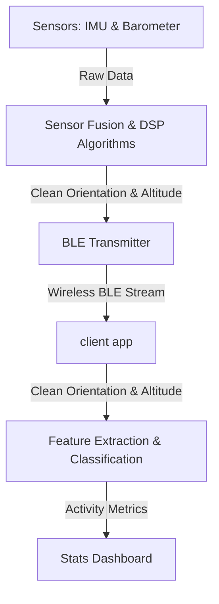

# Ultra-Compact BLE Fitness Tracker

> **Category:** Hardware & IoT  
> **GitHub Link:** [Explore on GitHub](https://github.com/Pasindu-Vihangana)  
> **Tags:** `PCB Design` `Sensor Fusion` `DSP Filtering` `Bluetooth Low Energy` `MATLAB`

A state-of-the-art, power-efficient wearable fitness tracker designed to capture intricate motion metrics, track velocity curves, and measure displacement of specific physical activities in real-time.

---

## 📸 Project Showcase

### Hardware Prototype
The tracker features an ultra-compact form factor (15mm x 25mm) engineered on a sophisticated 4-layer PCB.

| Prototype Overview | Size Comparison (vs. Coin) |
| :---: | :---: |
|  |  |

### Real-Time Activity Tracking Demo
The system uses Bluetooth Low Energy (BLE) to transmit real-time motion metrics to a Python dashboard during exercises (e.g., biceps curls).

---

## 🛠️ Technical Specifications

### Hardware Architecture
- **Microcontroller (MCU):** **Nordic nRF52840** — Serves as the central processor, orchestrating DSP computations and managing wireless communications with ultra-low power consumption.
- **Inertial Measurement Unit (IMU):** **6-DoF Sensor** — Captures comprehensive tri-axial acceleration and angular velocity data to determine device spatial orientation and movement.
- **Digital Pressure Sensor:** Gauges environmental atmospheric pressure, providing critical data for accurate altitude variation measurements.
- **Power Management IC (PMIC):** Guarantees optimal battery charging and power management, a pivotal feature for wearable longevity.

### Structural & PCB Design
- **4-Layer PCB Layout:** A high-density, multi-layer routing stack ensures minimal interference and stable power distribution.
- **Micro Form Factor:** Strategic component placement packs all sensors, charging ports, and MCU into a **15mm × 25mm** footprint.

---

## 🧠 Software & Algorithm Architecture

### 1. DSP & Sensor Fusion
Sensor fusion algorithms combine accelerometer, gyroscope, and pressure sensor outputs to filter out noise, outputting stable relative altitude and spatial orientation angles.

### 2. Feature Extraction & Classification
- **MATLAB Simulations:** Initial mathematical modeling, signal processing design, and feature extraction logic were built and simulated in MATLAB.
- **C++ On-Device Implementation:** Optimized algorithms were ported to C++ and compiled directly to the nRF52840 MCU to perform low-latency, real-time motion classification on-device.

### 3. Wireless Data Stream
Processed exercise parameters are transmitted over BLE:
- **Displacement (m):** Cumulative distance traveled during a repetition.
- **Mean Velocity (m/s):** Average velocity of the repetition.
- **Peak Velocity (m/s):** Maximum velocity recorded.
- **Duration (s):** Elapsed time of the movement cycle.
Some stages raw data was transmitted over BLE to enable further analysis and visualization.
