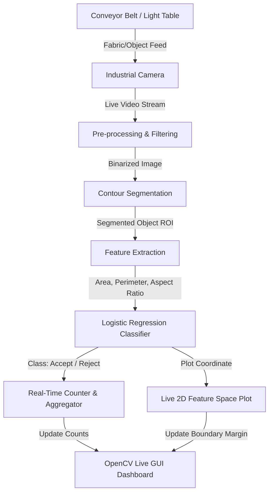

# 🧵 Garment Piece Counter & Classifier — Computer Vision & Machine Learning POC

> **Category:** AI & Computer Vision  
> **GitHub Link:** [Explore on GitHub](https://github.com/Pasindu-Vihangana)  
> **Tags:** `YOLO` `OpenCV` `Python` `Machine Learning` `Industrial Automation`

## Overview
A real-time computer vision and machine learning system designed to automate garment piece counting and quality control. Originally developed in partnership with **MAS Holdings** (Apr 2021 – Dec 2021) as a solution for high-accuracy textile inventory tracking, this system serves as a powerful proof of concept (POC) for automated sorting, defect detection, and count validation in a wide range of industrial environments.

---

## 📹 Proof of Concept Demonstration (`GPC-POC.mp4`)
The video demonstration showcases the live visual classification and counting system in action:

* **Duration**: 2 minutes and 20 seconds of real-time processing.
* **Layout**: A split-screen OpenCV dashboard displaying:
  * **Left Panel (Live Visual Feed)**: Displays the camera capture of the fabric pieces. The system applies contour segmentation to isolate each fabric piece and extract its geometric shape descriptors.
  * **Right Panel (Feature Space Scatter Plot)**: Renders a dynamic 2D feature space where each detected item is plotted in real time relative to the **Logistic Regression decision boundary line**. The feature space illustrates the separator between **Accepted** (within tolerance) and **Rejected** (deformed or incorrect) shapes.
* **Counting Mechanism**: As fabric pieces pass through, they are classified on-the-fly, incrementing the accepted and rejected piece logs without manual intervention.

---

## 💡 Portability: A Foundation for Many Applications
While developed for apparel manufacturing, the core architecture—combining real-time shape analysis with lightweight classifiers—is highly portable. It represents an industrial POC for:
1. **Quality Control & Defect Detection**: Identifying irregular cuts, dimensions, or surface damage in automated lines (e.g., rubber gaskets, metal stamping, composite panels).
2. **Agricultural Sorting & Grading**: Classifying fruits, vegetables, seeds, or grains by size and shape eccentricity (e.g., separating bruised produce).
3. **Logistics & Package Sorting**: Scanning items on sorting belts to check if packaging dimensions match stock keeping units (SKUs).
4. **Recycling & Waste Management**: Auto-sorting plastic, paper, and metal items based on contour features.
5. **Biomedical Vial & Pill Counting**: Tracking pharmaceuticals on high-speed lines to identify cracked pills or under-filled packages.

---

## 🛠️ Key Features
* **Real-time Contour Segmentation**: High-frequency edge detection and adaptive thresholding to isolate shapes from the background.
* **Geometric Feature Extraction**: Extracts normalized area, perimeter, aspect ratio, and eccentricity parameters for each piece.
* **Logistic Regression Classifier**: A computationally efficient classifier trained to distinguish between correct cut pieces (accepted) and deformed pieces (rejected) based on geometric features.
* **Live Feature Plotting**: Visually tracks classification confidence and margins in real time, serving as an intuitive debug dashboard for industrial operators.

---

## 📐 System Architecture & Data Flow

---

## 📊 Algorithmic Approach

### 1. Shape Segmentation
Applying adaptive thresholding and morphological operations (dilations, erosions) to handle ambient lighting variances on industrial floors:
$$I_{bin}(x, y) = \begin{cases} 255 & \text{if } I(x, y) > T_{adaptive}(x, y) \\ 0 & \text{otherwise} \end{cases}$$

### 2. Feature Vector Formulation
For each segmented contour, the system calculates a feature vector $\mathbf{x} = [x_1, x_2]^T$ where:
* $x_1$: Normalized Area to Perimeter ratio (indicating shape roundness / density).
* $x_2$: Aspect Ratio (width / height of bounding rectangle).

### 3. Classification
A Logistic Regression classifier calculates the probability $P(Y=1 | \mathbf{x})$ that the garment piece is **Accepted**:
$$P(Y=1 | \mathbf{x}) = \sigma(\mathbf{w}^T \mathbf{x} + b) = \frac{1}{1 + e^{-(\mathbf{w}^T \mathbf{x} + b)}}$$
* If $P(Y=1 | \mathbf{x}) \ge 0.5 \implies$ **Accept**
* If $P(Y=1 | \mathbf{x}) < 0.5 \implies$ **Reject** (Trigger alarm or log error)

---

## 💡 Industrial Tuning Tips

> [!TIP]
> **For high-speed industrial deployment:**
> * **Lighting Calibration**: Use high-contrast backlighting (e.g., a light table) to simplify segmentation and make the system robust to changes in factory floor lighting.
> * **Hardware Acceleration**: For line speeds above 2 m/s, convert the logistic regression pre-processing steps into C++ or utilize OpenCV's CUDA module to reduce frame latency below 5ms.
> * **Feature Expansion**: If fabric shades or textures vary, append average Hue/Saturation/Value (HSV) statistics to the feature vector to enable color sorting.
